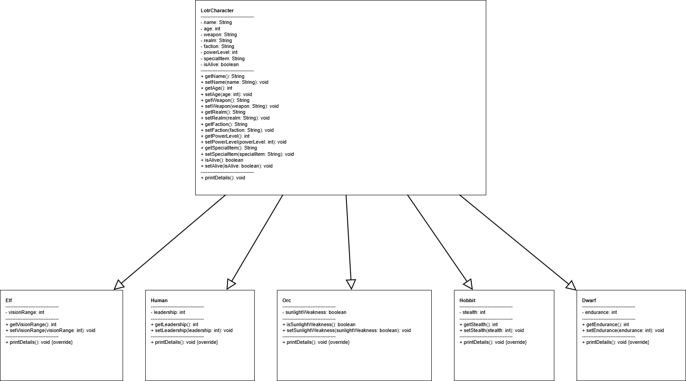
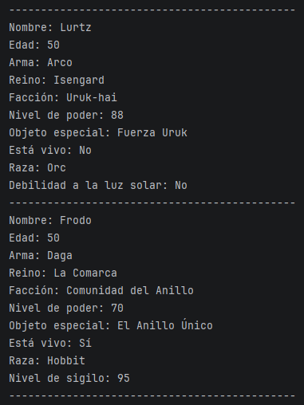

[Versión en español](README.md)

# 🧙‍♂️ The Lord of the Rings — Java (OOP)


[](https://github.com/)

Vanilla Java OOP project inspired by The Lord of the Rings universe, focused on practicing encapsulation, inheritance, and polymorphism through a character and race hierarchy.

## Index

- [🎯 Objective](#-objective)
- [✅ Completed Requirements](#-completed-requirements)
- [🧩 UML Design](#-uml-design)
- [📁 Project Structure](#-project-structure)
- [🧠 Applied OOP Concepts](#-applied-oop-concepts)
- [▶️ Run](#️-run)
- [🖥️ Real Program Execution](#️-real-program-execution)
- [📸 Evidence](#-evidence)
- [👤 Author](#-author)

## 🎯 Objective

Build a Vanilla Java project with one superclass (`LotrCharacter`) and five derived races (`Elf`, `Human`, `Orc`, `Hobbit`, `Dwarf`), creating 3 characters for each race in `Main.java` and invoking `printDetails()` to demonstrate polymorphism.

## ✅ Completed Requirements

- [x] `LotrCharacter` superclass with private attributes, getters, and setters.
- [x] `printDetails()` method defined in the superclass.
- [x] Five subclasses extending `LotrCharacter`: `Elf`, `Human`, `Orc`, `Hobbit`, `Dwarf`.
- [x] Race-specific attribute per class:
  - [x] `Elf` → `visionRange`
  - [x] `Human` → `leadership`
  - [x] `Orc` → `sunlightWeakness`
  - [x] `Hobbit` → `stealth`
  - [x] `Dwarf` → `endurance`
- [x] `printDetails()` overridden in every subclass.
- [x] `super.printDetails()` invoked before printing subclass-specific data.
- [x] 3 characters created for each of the 5 races in `Main.java`.
- [x] Polymorphism demonstrated by calling `printDetails()`.

## 🧩 UML Design

The following diagram represents the class hierarchy and inheritance relationships of the project:



## 📁 Project Structure

```text
senor-de-los-anillos-java/
├─ docs/
│  ├─ console-output.png
│  └─ lotrdrawio.png
└─ src/
   └─ lotr/
      ├─ app/
      │  └─ Main.java
      ├─ model/
      │  └─ LotrCharacter.java
      └─ races/
         ├─ Dwarf.java
         ├─ Elf.java
         ├─ Hobbit.java
         ├─ Human.java
         └─ Orc.java
```

## 🧠 Applied OOP Concepts

### 🔒 Encapsulation

The `LotrCharacter` superclass defines private attributes (`name`, `age`, `weapon`, `realm`, `faction`, `powerLevel`, `specialItem`, `isAlive`) and exposes access through getters and setters.

### 🧬 Inheritance

`Elf`, `Human`, `Orc`, `Hobbit`, and `Dwarf` inherit from `LotrCharacter`, reusing common structure and extending behavior with race-specific fields.

### 🎭 Polymorphism

Each subclass overrides `printDetails()`, calls `super.printDetails()` first, and appends race-specific information. In `Main.java`, invoking this method across different race objects demonstrates polymorphic behavior.

## ▶️ Run

IntelliJ option:

Run `Main.java` from the IDE.

Terminal option:

```bash
javac -d out src/lotr/model/*.java src/lotr/races/*.java src/lotr/app/Main.java
java -cp out lotr.app.Main
```

## 🖥️ Real Program Execution

Below is the real output generated by the program when executing `Main.java`:



Output may vary depending on the data defined in `Main.java`.

## 📸 Evidence

- Console output screenshot in `/docs/console-output.png`.
- UML diagram in `/docs/lotrdrawio.png`.
- Commits following Conventional Commits.

## 👤 Author

**David Navarro**
